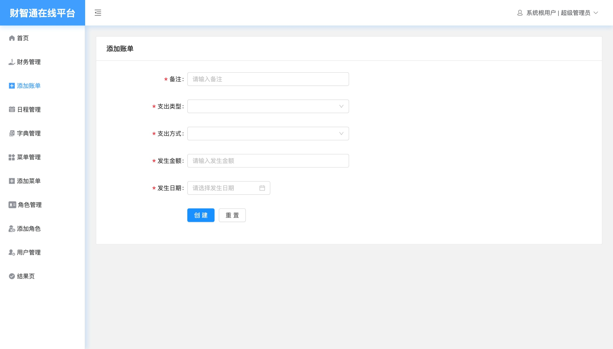

<!--
 * @Author: ZhangXiaolu
 * @Date: 2022-11-03 10:12:38
 * @LastEditTime: 2022-07-29 10:12:38
 * @LastEditors: ZhangXiaolu
 * @FilePath: personal-workstation\README.md
-->

~~# PWMS_PC~~

# iCloudManager

~~Presonal Workstation Management System For PC~~

## ~~个人记账本-工作站 PWMS 系统[V4]~~

## 财智通在线平台（云上管家）[V5]

### 预览地址：http://121.229.99.43:8088

```
[+]新增 [-]删除 [^]升级 [#]修复 [*]重构优化
rc：未对外发布版本
internal：研发内部版本。即从来没有发布过的版本
Feature:功能性的增加或删除
Fix：Bug的修复
Upgrade：组件或第三方依赖的升级
Enhance：代码重构或优化或格式化等
--：表示暂时没有
```

## 1、环境配置

|        工具        |  版本   |       作用       |
| :----------------: | :-----: | :--------------: |
| visual studio Code | Stable  |      编译器      |
|  Navicat Premium   |   16    | 数据库可视化工具 |
|      phpstudy      |  最新   |  MySQL 服务工具  |
|       Vue.js       |    2    |    客户端框架    |
|       Koa.js       |    2    |    服务端框架    |
|      Node.js       | 14.16.x |     开发环境     |
|      Nuxt.js       |    2    |     开发环境     |

## 2、项目启动

### 请牢记切换分支 ！important

```
启动MySQL服务
导入其中的数据库表「先创建数据库」
--npm i
(依赖包安装好后再进行其它操作)
在backend\db里修改自己的SQL配置
--npm start/npm run dev
(后端是`start`命令,前端是`run dev`)
```

## 3、项目介绍

---更新于 2024.1

### 好久没有迭代了，现在学校不忙了再回来改进改进

---

~~1.因为本人比较穷 B，需要一个记账本来管理和查看平时的支出用度，本来是想当伸手党直接拿一个现成的用，无奈找不到符合自己需求的，迫于无奈自己做了一个，前后端都是基于 js 所搭建，采用的也是无门槛且没有任何花哨的技术，纯属是为了快速且简易的当成一个记事本使用，配合很简单的增删改查来使用，虽然其中还存在很多问题，不过无伤大雅不影响使用即可，如果各位有需要可以自取随意使用，或者帮我升级升级完善一下功能或修复一下 BUG 本人更是跪谢~~

2.本项目采用敏捷方法开发，以 MVP 方式逐步迭代，有时为了达到效果不得已背负技术债务，各位看官老爷不要放在心上，全当黑盒使用就好，感恩～

3.本人目前延边大学教育学研究生在读(所以我是计算机小白)，持有 PMP 资格证，AWS 云从业资格证，微软 PL-900 和 MB-330 资格证；有同校的朋友可以联系我V 18636292309交流～感谢～

4.如果能有好的工作机会还请直接私信我，我给您先陪一根！

## 4、联系方式

如有更好的建议或不懂的需要解释，请私信即可

## 5、系统初始流程图


## 6、开发日志

```
V5_20240101：
[^]整体采用新框架重做
新版本增加了系统配置，可以为用户配置角色，角色分配菜单等
```





```
V4_20230712：
1.[^]首页的分类记账功能和上月对比功能打开了，但是还是写死的，目前此问题已记录在问题日志并在待办事项列表最高优先级，下个版本修复
2.[+]新增了日程功能 可以在日历上添加日程了
```


```
V3_20230506：
整体UI升级
1.[^]首页看板变为卡片面板，消费控制为百分比 并配有记事本功能，与上月的财务对比这块功能还在加紧开发，预计一到两个迭代上线
2.[^]记账列表弥补了技术债务，优化了查询
3.[^]字典可以设置启用和停用了
4.[+]新增了用户管理功能，此版本开始支持多用户了！
5.[+]可以退出登录了
```


```
V2_20230406：
1.[^]首页：首页看板添加了和上月支出对比的百分比，方便更好控制消费
2.[^]记账列表：可以拉取自定义的字典值了
3.[+]新增了字典配置
```


```
V1_20220323：
1.[+]首页：展示本月和上月的财务统计，添加了悬浮的说明，方便在记账时归类
2.[+]记账列表：记账列表（部分内容写死，仅供单人使用）
3.[+]登录
```


